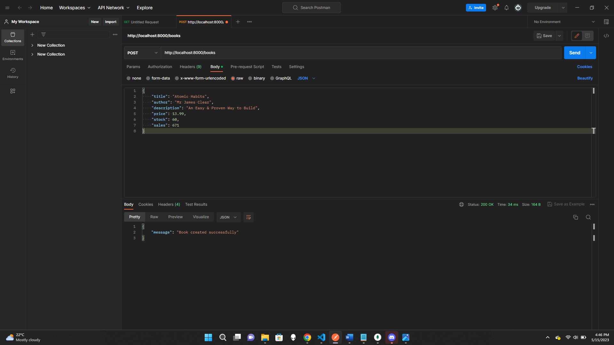
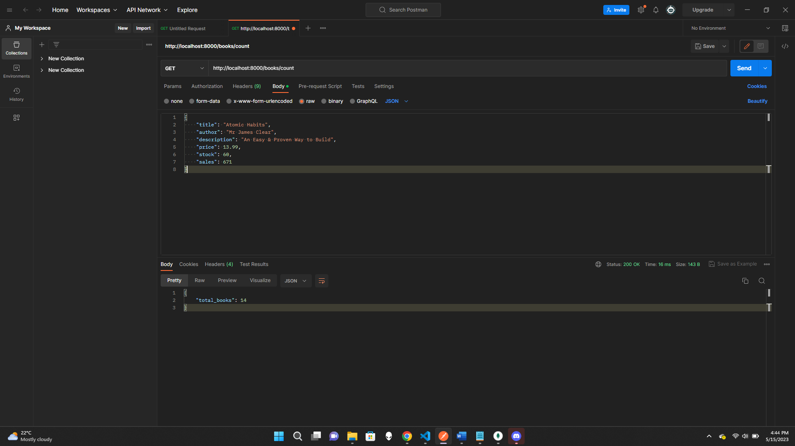
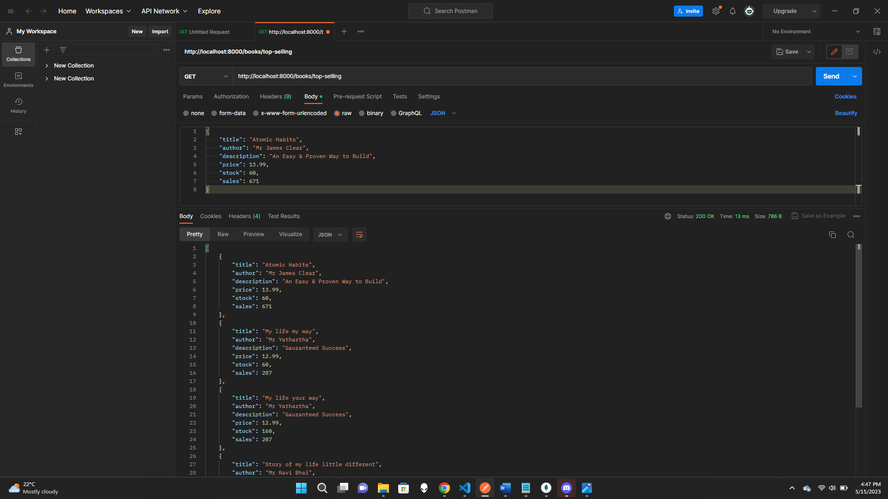
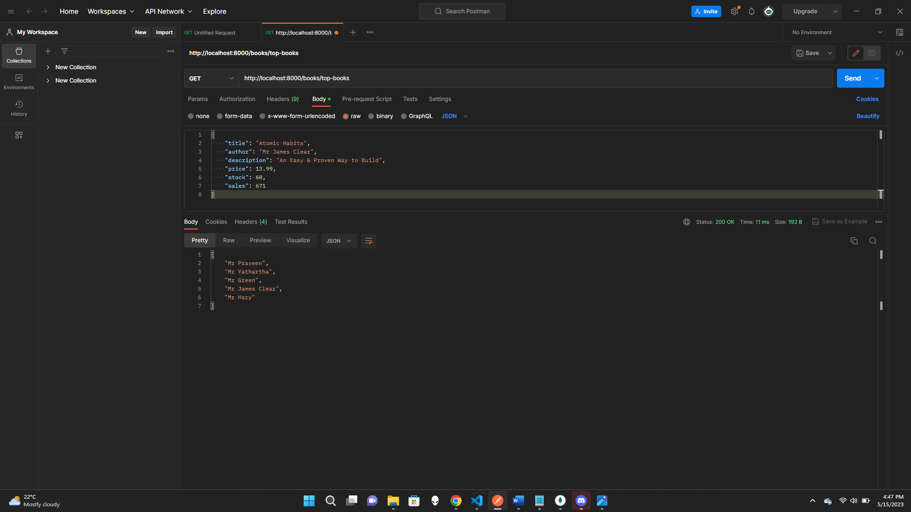
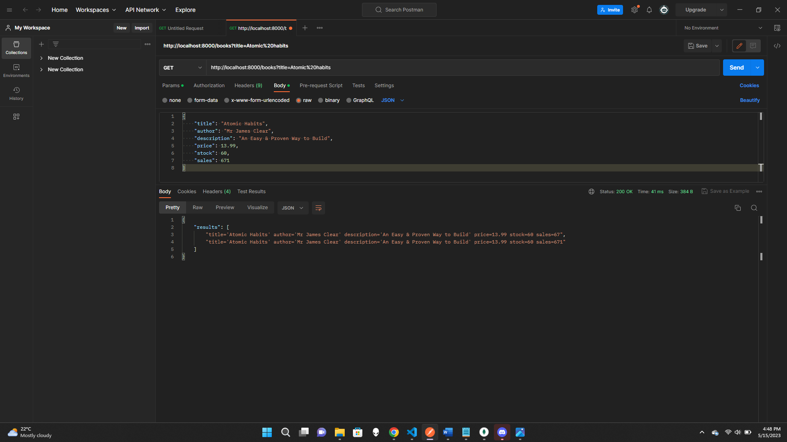
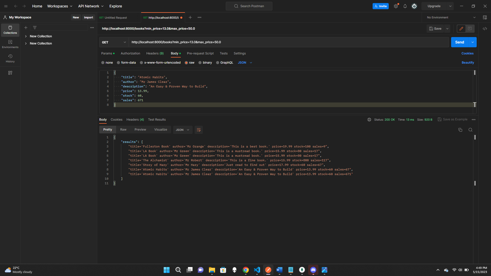
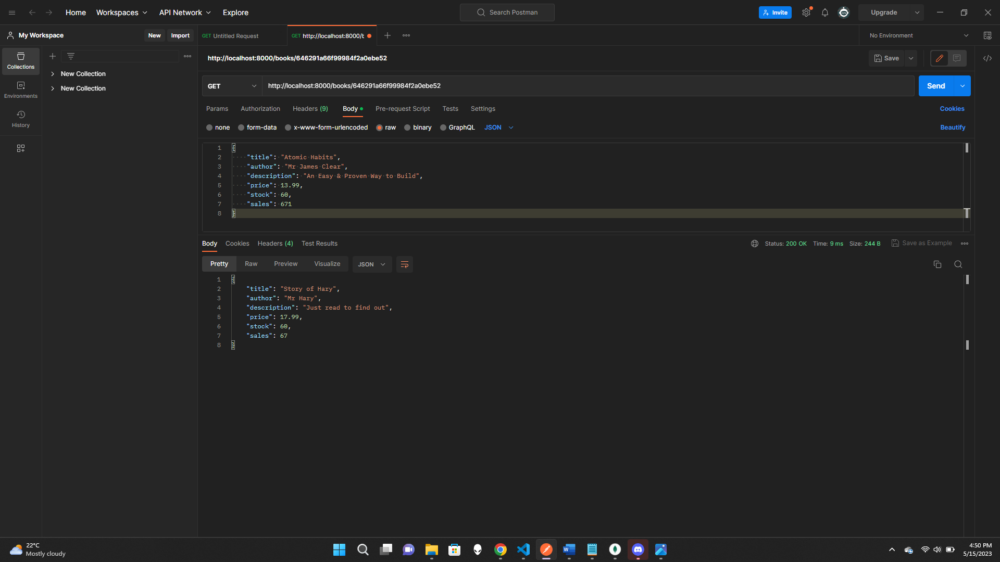
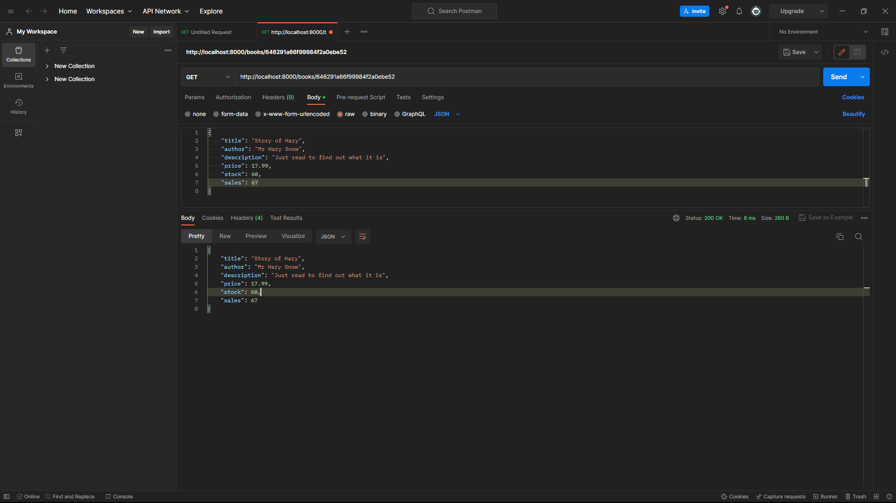
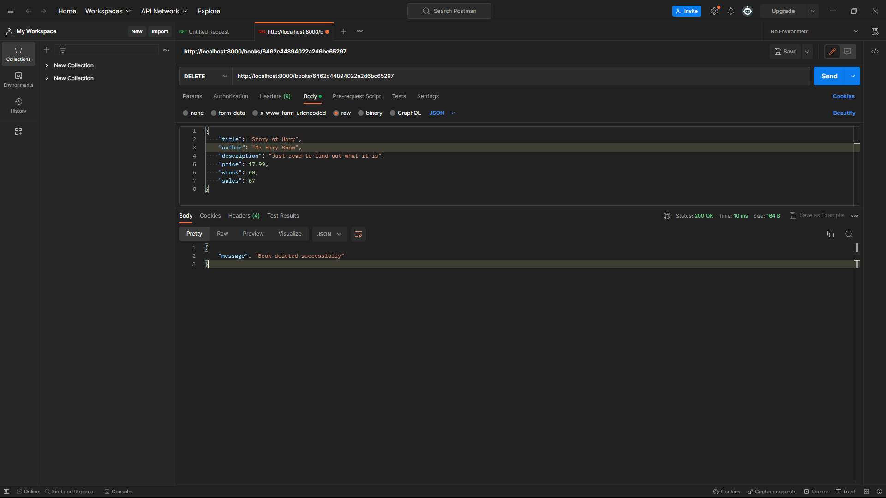

# **Online Bookstore API using FastAPI README**

## **Group Member Details:**
- Member 1: Hardik Bhawsar (885191064) (hardik_bhawsar@csu.fullerton.edu)
- Member 2: Yathartha Patankar (885189803) (yatharthapatankar@csu.fullerton.edu)

## **Introduction:**
This project is an online bookstore API that provides users with the ability to view, search, and purchase books. It is built using FastAPI, a modern web framework for building APIs, and utilizes MongoDB, to store the book data.

The API offers a range of features to enhance the user experience. It includes a Pydantic model for the book data, which ensures the data is properly structured and validated before being stored in the MongoDB database. The API also utilizes MongoDB's aggregation framework to retrieve essential information such as the total number of books in the store, the top 5 bestselling books, and the top 5 authors with the most books in the store.

## **Objective:**
- API Functionality: Create a robust API with essential features such as retrieving a list of books, getting detailed information about a specific book, adding new books to the store, updating existing books, and deleting books.

- Data Validation and Modeling: Implement data validation using Pydantic models to ensure the integrity and correctness of book data before storing it in the database.

- MongoDB Integration: Utilize MongoDB as the database to store the book inventory, leveraging its flexibility and scalability for handling book-related data.

- Aggregation and Indexing: Utilize MongoDB's aggregation framework to extract important information, such as the total number of books in the store, the top bestselling books, and the top authors with the most books. Create appropriate indexes to optimize query performance.

- Search Functionality: Implement search functionality that allows users to search for books based on criteria such as title, author, and price range using MongoDB's query operators.

- Asynchronous Programming: Perform all database operations asynchronously to ensure the API remains responsive and performant, even under high loads.

## **Prerequisites:**
To run this, you need to have the following installed:
- Python
- FastAPI
- Pydantic
- MongoDB
- PyMongo
- MongoDB Compass
- Git
<<<<<<< HEAD
- Text Editor or IDE
=======
- VS Code Editor
>>>>>>> 9d32ba09a9c537da372ebd079855a70fe74cd4b0

## **Steps to Run:**
To run the project, you will need to do following steps:
- Clone the Repository 
- Install all the dependencies.
- Set Up MongoDB. 
- Configure Connection to MongoDB.
- Run the Application.
- Open an API testing tool "Postman" to test the project.

## **Installation:**
To install the project, follow these steps:

### **Using CMD:**
**Step 1:** Navigate to the project directory in your command line interface.

**Step 2:** Install the required dependencies by running the following command:
```pip install -r requirements.txt```

**Step 3:** Install MongoDB on your system if you haven't already. Refer to the MongoDB documentation for instructions specific to your operating system.

**Step 4:** Open the main.py file in a text editor. Locate the MongoDB connection configuration section. Modify the MongoDB connection string to match your MongoDB setup (e.g., database name, host, port).

**Step 5:** To Run the project type the following command.
```uvicorn main:app --reload```

**Step 6:** In postman, Make API requests to the available endpoints (e.g., http://localhost:8000/books) and verify the responses.

<<<<<<< HEAD
## **How to run and use the API :**

**Step 1:** Make sure you have MongoDB installed and running on your local machine. Update the connection_url in the code to match your MongoDB connection URL.

**Step 2:** Install the required dependencies. You can do this by creating a virtual environment and activating it, then running the following command in your project directory:

```pip install fastapi pymongo motor uvicorn```

**Step 3:** Save the code in a Python file, for example, main.py. Start the FastAPI server using the following command:

```uvicorn main:app --reload```

**Step 4:** Once the server starts, open Postman.

**Step 5:** To create a book, create a new request in Postman and set the request method to POST. Set the request URL to http://localhost:8000/books. In the request body, provide the book data in JSON format. Send the request, and the response will contain a success message.

**Step 6:** To get the total number of books, create a new request in Postman and set the request method to GET. Set the request URL to http://localhost:8000/books/count. Send the request, and the response will contain the total number of books.

**Step 7:** To search for books based on criteria such as title, author, minimum price, or maximum price, create a new request in Postman and set the request method to GET. Set the request URL to http://localhost:8000/books. Optionally, add query parameters to filter the search. Send the request, and the response will contain a list of books matching the search criteria.

**Step 8:** To get the top selling books, create a new request in Postman and set the request method to GET. Set the request URL to http://localhost:8000/books/top-selling. Send the request, and the response will contain a list of the top-selling books.

**Step 9:** To get the top authors with the most books, create a new request in Postman and set the request method to GET. Set the request URL to http://localhost:8000/books/top-books. Send the request, and the response will contain a list of the top authors.

**Step 10:** To get a book by its ID, create a new request in Postman and set the request method to GET. Set the request URL to http://localhost:8000/books/{book_id}, where {book_id} is the ID of the book. Send the request, and the response will contain the book data if found, or a message indicating no book found.

**Step 11:** To update a book, create a new request in Postman and set the request method to PUT. Set the request URL to http://localhost:8000/books/{book_id}, where {book_id} is the ID of the book. Include the updated book data in the request body. Send the request, and the response will contain a success message.

**Step 12:** To delete a book, create a new request in Postman and set the request method to DELETE. Set the request URL to http://localhost:8000/books/{book_id}, where {book_id} is the ID of the book. Send the request, and the response will contain a success message.

## **Screenshots for References:**
Below are the screenshots of the web application with responses from Postman:




















